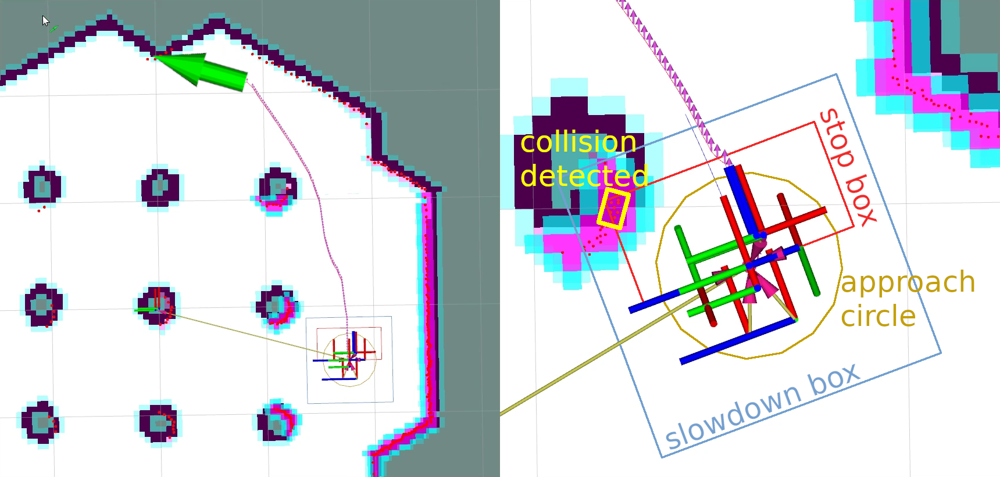
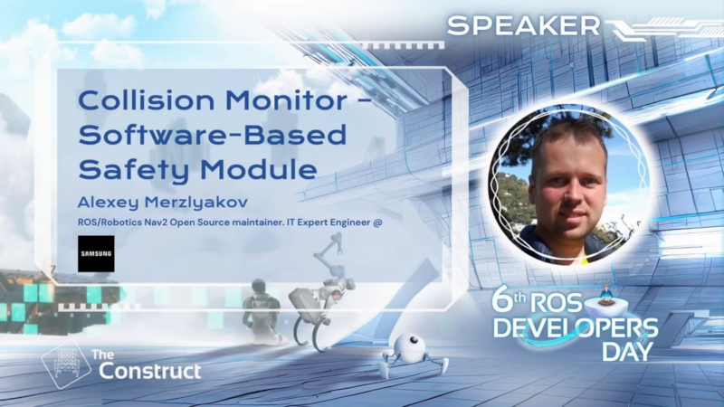
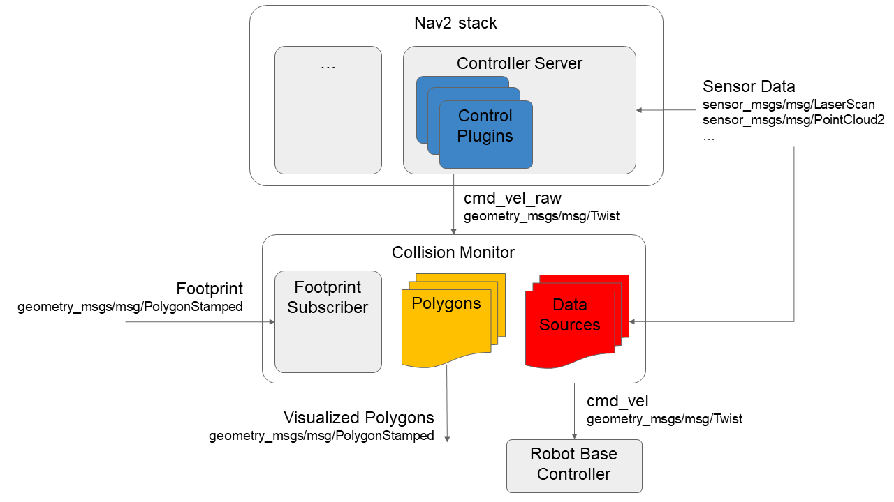

# Nav2 Collision Monitor

## Collision Monitor

The Collision Monitor is a node providing an additional level of robot safety.
It performs several collision avoidance related tasks using incoming data from the sensors, bypassing the costmap and trajectory planners, to monitor for and prevent potential collisions at the emergency-stop level.

This is analogous to safety sensor and hardware features; take in laser scans from a real-time certified safety scanner, detect if there is to be an imminent collision in a configurable bounding box, and either emergency-stop the certified robot controller or slow the robot to avoid such collision.
However, this node is done at the CPU level with any form of sensor.
As such, this does not provide hard real-time safety certifications, but uses the same types of techniques with the same types of data for users that do not have safety-rated laser sensors, safety-rated controllers, or wish to use any type of data input (e.g. pointclouds from depth or stereo or range sensors).

This is a useful and integral part of large heavy industrial robots, or robots moving with high velocities, around people or other dynamic agents (e.g. other robots) as a safety mechanism for high-response emergency stopping.
The costmaps / trajectory planners will handle most situations, but this is to handle obstacles that virtually appear out of no where (from the robot's perspective) or approach the robot at such high speed it needs to immediately stop to prevent collision.



Demonstration of Collision Monitor abilities presented at 6th ROS Developers Day 2023, could be found below:

[](https://www.youtube.com/watch?v=bWliK0PC5Ms)

### Features

The Collision Monitor uses polygons relative the robot's base frame origin to define "zones".
Data that fall into these zones trigger an operation depending on the model being used.
A given instance of the Collision Monitor can have many zones with different models at the same time.
When multiple zones trigger at once, the most aggressive one is used (e.g. stop > slow 50% > slow 10%).

The following models of safety behaviors are employed by Collision Monitor:

* **Stop model**: Define a zone and a point threshold. If more that `N` obstacle points appear inside this area, stop the robot until the obstacles will disappear.
* **Slowdown model**: Define a zone around the robot and slow the maximum speed for a `%S` percent, if more than `N` points will appear inside the area.
* **Approach model**: Using the current robot speed, estimate the time to collision to sensor data. If the time is less than `M` seconds (0.5, 2, 5, etc...), the robot will slow such that it is now at least `M` seconds to collision. The effect here would be to keep the robot always `M` seconds from any collision.

The zones around the robot can take the following shapes:

* Arbitrary user-defined polygon relative to the robot base frame, which can be static in a configuration file or dynamically changing via a topic interface.
* Robot footprint polygon, which is used in the approach behavior model only. Will use the static user-defined polygon or the footprint topic to allow it to be dynamically adjusted over time.
* Circle: is made for the best performance and could be used in the cases where the zone or robot footprint could be approximated by round shape.
* VelocityPolygon: allow switching of polygons based on the command velocity. When the velocity is covered by multiple sub polygons, the first sub polygon in the `velocity_polygons` list will be used. This is useful for robots to set different safety zones based on their velocity (e.g. a robot that has a larger safety zone when moving at 1.0 m/s than when moving at 0.5 m/s).


The data may be obtained from different data sources:

* Laser scanners (`sensor_msgs::msg::LaserScan` messages)
* PointClouds (`sensor_msgs::msg::PointCloud2` messages)
* IR/Sonars (`sensor_msgs::msg::Range` messages)

### Design

The Collision Monitor is designed to operate below Nav2 as an independent safety node.
This acts as a filter on the `cmd_vel` topic coming out of the Controller Server. If no such zone is triggered, then the Controller's `cmd_vel` is used. Else, it is scaled or set to stop as appropriate.

The following diagram is showing the high-level design of Collision Monitor module. All shapes (`Polygon`, `Circle` and `VelocityPolygon`) are derived from base `Polygon` class, so without loss of generality we can call them as polygons. Subscribed footprint is also having the same properties as other polygons, but it is being obtained a footprint topic for the Approach Model.


`VelocityPolygon` can be configured with multiple sub polygons and can switch between them based on the velocity.


### Configuration

Detailed configuration parameters, their description and how to setup a Collision Monitor could be found at its [Configuration Guide](https://docs.nav2.org/configuration/packages/configuring-collision-monitor.html) and [Using Collision Monitor tutorial](https://docs.nav2.org/tutorials/docs/using_collision_monitor.html) pages.


### Metrics

Designed to be used in wide variety of robots (incl. moving fast) and have a high level of reliability, Collision Monitor node should operate at fast rates.
Typical one frame processing time is ~4-5ms for laser scanner (with 360 points) and ~4-20ms for PointClouds (having 24K points).
The table below represents the details of operating times for different behavior models and shapes:

| | Stop/Slowdown/Limit model, Polygon area | Stop/Slowdown/Limit model, Circle area | Approach model, Polygon footprint | Approach model, Circle footprint |
|-|-----------------------------------|----------------------------------|-----------------------------------|----------------------------------|
| LaserScan (360 points) processing time, ms  | 4.45 | 4.45 | 4.93  | 4.86  |
| PointCloud (24K points) processing time, ms | 4.94 | 4.06 | 20.67 | 10.87 |

The following notes could be made:

 * Due to sheer speed, circle shapes are preferred for the approach behavior models if you can approximately model your robot as circular.
 * More points mean lower performance. Pointclouds could be culled or filtered before the Collision Monitor to improve performance.


## Collision Detector

In some cases, the user may want to be informed about the detected obstacles without affecting the robot's velocity and instead take a different action within an external node. For example, the user may want to blink LEDs or sound an alarm when the robot is close to an obstacle. Another use case could be to detect data points in particular regions (e.g extremely close to the sensor) and warn of malfunctioning sensors. For this purpose, the Collision Detector node was introduced.

It works similarly to the Collision Monitor, but does not affect the robot's velocity. It will only inform that data from the configured sources has been detected within the configured polygons via message to the `collision_detector_state` topic.

### Features

Similarly to the Collision Monitor, the Collision Detector uses polygons relative the robot's base frame origin to define "zones".
However, unlike the Collision Monitor that uses different behavior models, the Collision Detector does not use any of them and therefore the `action_type` should always be set to `none`. If set to anything else, it will implicitly be set to `none` and yield a warning.

The zones around the robot and the data sources are the same as for the Collision Monitor, with the exception of the footprint polygon, which is not supported by the Collision Detector.

### Configuration

Detailed configuration parameters, their description and how to setup a Collision Detector could be found at its [Configuration Guide](https://docs.nav2.org/configuration/packages/collision_monitor/configuring-collision-detector-node.html).

The `CollisionMonitor` node makes use of a [nav2_util::TwistSubscriber](../nav2_util/README.md#twist-publisher-and-twist-subscriber-for-commanded-velocities).


### Lidar estop prevention

We use this with a safety lidar with e-stop zones depending on speed and steering angle. We want to avoid hitting such a zone.
Thus, the collision monitor must ensure to limit the speed and steering angle so that the field chosen by
the lidar is not intersecting with any lidar points (that would trigger an estop).

#### Terminology

* **Bucket**: a steering angle range (e.g. -12° to 12°). A bucket groups multiple fields that share the same angle range.
* **Field**: a specific combination of steering angle bucket and velocity range. Each field corresponds to one `SubPolygonParameter` / velocity polygon entry.

During field set creation, we also generate corresponding velocity polygons. They are about 50% larger than the corresponding
e-stop zone. Example. Note that linear speed is for the steering wheel, not the baselink.

```yaml
forward_straight_mid_3:
  points: # polygon here
  linear_min: 0.5
  linear_max: 0.7
  steering_angle_min: -0.20944 # -12 degrees in radians
  steering_angle_max: 0.20944 # 12 degrees in radians
  linear_limit: 0.49 # steering wheel speed, not base link speed
```

Here, the **bucket** is the angle range [-12°, 12°]. The **field** is that bucket combined with the speed range [0.5, 0.7].

So - if we are between 0.5 and 0.7 m/s, and hit that warning field, we must reduce our speed to *below* that field - because there is an obstacle in the polygon,
which, if we approach it further, would trigger an estop.
Once we are at 0.49, we will be in another field with a smaller polygon on the lidar side. Thus, the velocity polygon is also smaller. If we keep approaching the obstacle, we would slow down further.
If the obstacle e.g. moves with us or is on the side, we can keep that speed.

### Step 1: Normal collision monitor with velocity polygon

### Step 2: Steering validation

If speed goes through zero (so sign(target speed) <> sign(current speed)):

* if abs(current speed) > low threshold → keep steering angle (we must anyway just slow down asap)
* if abs(current speed) < low threshold → allow steering

else:

1. check if both abs(target) and abs(current speed) are < low threshold. If yes → done
2. check if target angle is in same bucket as current angle. If yes →
   1. if the result velocity falls into the some faster field (same bucket), check the subsequent field for collision. Only the one-step faster field needs to be checked, even if target speed  is in a much faster field. if in collision, limit speed to current field → then done
   2. if target angle is in a different bucket → determine the direction of steering and find the neighbouring bucket from current angle in that direction. Only one bucket step at a time, even if the target angle is several buckets away.
3. in the neighbouring bucket, determine max speed / valid field
   1. start at fastest possible field (field for max(current speed, target speed)). If that is in collision, go down until a collision-free one is found. That one we call “valid” field. If all fields are in collision, use the slowest one with same speed sign in target direction (that is allowed even if in collision)
4. now adapt speed and steering angle
   1. limit target speed to max speed of valid field
   2. if current speed is larger than max valid speed: limit steering angle to boundary of current bucket

→ done

After some iterations, the current speed will be in the valid field → AMR will be allowed to steer, as in 4b, the current speed will not be above max valid speed